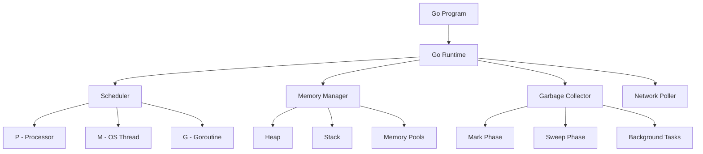

# Performance Fundamentals

Understanding Go's runtime internals is crucial for effective performance optimization. This section covers the foundational concepts that underpin all performance engineering in Go.

## Core Concepts Overview

### 🧠 What You Need to Know

Before diving into profiling and optimization, you must understand:

1. **[Go Runtime Internals](runtime-internals.md)** - How Go programs execute
2. **[Memory Model](memory-model.md)** - Memory management and allocation
3. **[Goroutine Scheduler](goroutine-scheduler.md)** - Concurrency and scheduling
4. **[Garbage Collector](garbage-collector.md)** - Memory reclamation and GC tuning

### 🎯 Learning Objectives

By mastering these fundamentals, you'll be able to:

- **Predict performance characteristics** of Go code before writing it
- **Identify optimization opportunities** by understanding runtime behavior
- **Make informed decisions** about data structures and algorithms
- **Tune runtime parameters** for optimal performance
- **Debug complex performance issues** with deep runtime knowledge

## Why Fundamentals Matter

### Performance Anti-patterns

Many performance issues stem from misunderstanding Go's runtime:

```go
// ❌ Poor: Creates slice on each call
func badExample() []string {
    return []string{"item1", "item2", "item3"}
}

// ✅ Good: Reuses pre-allocated slice
var items = []string{"item1", "item2", "item3"}
func goodExample() []string {
    return items
}
```

### The Performance Mindset

Effective Go performance engineering requires thinking in terms of:

- **Allocation patterns**: Where and when memory is allocated
- **Cache locality**: How data layout affects CPU performance  
- **Goroutine lifecycle**: Creation, scheduling, and destruction costs
- **GC pressure**: Impact of allocation patterns on garbage collection

## Key Performance Principles

### 1. Allocation Avoidance
```go
// Understand allocation sources
var buf []byte = make([]byte, 0, 1024) // Pre-allocate
buf = append(buf, data...)             // Reuse buffer
```

### 2. Cache-Friendly Data Structures
```go
// Struct layout matters for performance
type Efficient struct {
    id       uint64  // 8 bytes
    active   bool    // 1 byte + 7 bytes padding
    name     string  // 16 bytes (string header)
}
```

### 3. Goroutine Efficiency
```go
// Pool goroutines instead of creating per-task
var workerPool = make(chan func(), 100)

func init() {
    for i := 0; i < runtime.NumCPU(); i++ {
        go worker()
    }
}
```

### 4. GC-Aware Programming
```go
// Minimize garbage collection pressure
type Pool struct {
    pool sync.Pool
}

func (p *Pool) Get() *Buffer {
    if v := p.pool.Get(); v != nil {
        return v.(*Buffer)
    }
    return &Buffer{}
}
```

## Runtime Architecture Overview



## Performance Measurement Context

Understanding runtime internals helps interpret profiling data:

### CPU Profiles
- **Function costs**: Direct execution time vs. allocation overhead
- **Runtime overhead**: Scheduler, GC, and system call costs
- **Instruction-level insights**: Cache misses, branch prediction

### Memory Profiles  
- **Allocation sources**: Stack vs. heap allocation decisions
- **Object lifecycle**: Creation, usage, and collection patterns
- **Memory layout**: Fragmentation and locality impacts

### Goroutine Profiles
- **Scheduling overhead**: Context switch costs and runqueue analysis
- **Blocking patterns**: Channel operations, mutex contention, syscalls
- **Lifecycle management**: Creation and destruction patterns

## Learning Path

### Beginner Track (2-3 hours)
1. Read **Runtime Internals** overview
2. Understand basic **Memory Model** concepts
3. Learn **Goroutine Scheduler** fundamentals

### Intermediate Track (4-6 hours)
1. Deep dive into **Memory Management** 
2. Study **GC algorithms** and tuning
3. Practice with runtime diagnostics

### Advanced Track (8+ hours)
1. Master **runtime parameters** and tuning
2. Understand **low-level optimizations**
3. Study **production debugging** techniques

## Practical Application

Each fundamental concept includes:

- **Theoretical foundation**: Core concepts and algorithms
- **Practical examples**: Real code demonstrating principles  
- **Measurement techniques**: How to profile and analyze
- **Optimization strategies**: Actionable improvement techniques
- **Production considerations**: Real-world deployment insights

## Tools and Diagnostics

Learn to use runtime diagnostics effectively:

```bash
# Runtime statistics
GODEBUG=gctrace=1 go run main.go

# Scheduler tracing  
GODEBUG=schedtrace=1000 go run main.go

# Memory debugging
GODEBUG=allocfreetrace=1 go run main.go

# Runtime environment inspection
go env GOMAXPROCS
go env GOGC
```

## Prerequisites

- Basic Go programming experience
- Understanding of computer architecture concepts
- Familiarity with operating system fundamentals
- Command-line proficiency

## Ready to Begin?

Start with **[Go Runtime Internals](runtime-internals.md)** to build your foundation, then progress through each topic systematically.

Remember: **Deep understanding of fundamentals accelerates all future optimization work**. Time invested here pays dividends throughout your performance engineering journey.

---

**Next**: [Go Runtime Internals](runtime-internals.md) - Understanding how Go programs execute
