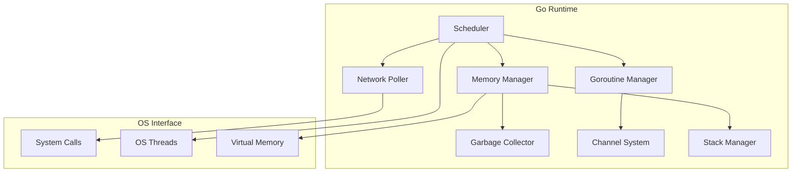

# Go Runtime Internals

Understanding Go's runtime architecture is fundamental to performance optimization. This chapter explores how Go programs execute, from source code to machine instructions.

## Runtime Architecture Overview

The Go runtime is a sophisticated system that manages program execution, memory, concurrency, and system resources. Unlike many other languages, Go's runtime is compiled directly into your application binary.

### Core Runtime Components



## The Go Execution Model

### 1. Program Initialization

When a Go program starts, the runtime performs several critical steps:

```go
// Conceptual runtime initialization sequence
func runtimeInit() {
    // 1. Initialize memory management
    mallocInit()
    
    // 2. Set up garbage collector
    gcInit()
    
    // 3. Initialize scheduler
    schedInit()
    
    // 4. Create initial goroutine (main)
    newProc(mainPC)
    
    // 5. Start scheduler
    schedule()
}
```

**Initialization Steps:**

1. **Memory Setup**: Establish heap, stack pools, and memory allocators
2. **GC Initialization**: Configure garbage collection parameters  
3. **Scheduler Setup**: Create processor contexts and thread pools
4. **Main Goroutine**: Create and schedule the main function
5. **Runtime Services**: Start background tasks (GC, network poller)

### 2. The Scheduler (GMP Model)

Go's scheduler implements the GMP (Goroutine-Machine-Processor) model:

```go
// Simplified scheduler structures
type G struct {  // Goroutine
    stack       stack    // Goroutine stack
    sched       gobuf    // Saved execution context
    atomicstatus uint32  // Goroutine state
}

type M struct {  // Machine (OS Thread)
    g0      *G          // Special goroutine for scheduler
    curg    *G          // Current running goroutine
    p       *P          // Attached processor
}

type P struct {  // Processor (Logical CPU)
    runq     [256]*G    // Local run queue
    runqhead uint32     // Queue head
    runqtail uint32     // Queue tail
}
```

**Scheduler Operation:**

```go
func schedule() {
    for {
        // 1. Find a runnable goroutine
        gp := findrunnable()
        
        // 2. Execute the goroutine
        execute(gp)
        
        // 3. Goroutine yielded/blocked, repeat
    }
}

func findrunnable() *G {
    // Priority order:
    // 1. Local run queue (P)
    // 2. Global run queue
    // 3. Network poller
    // 4. Work stealing from other Ps
}
```

### 3. Memory Management

The runtime manages memory through multiple layers:

#### Stack Management
```go
// Stack growth mechanics
func growstack(gp *G) {
    // 1. Allocate larger stack
    newstack := stackalloc(newsize)
    
    // 2. Copy current stack contents
    copystack(gp, newstack)
    
    // 3. Update pointers
    adjustpointers(gp, newstack)
    
    // 4. Switch to new stack
    gp.stack = newstack
}
```

#### Heap Allocation
```go
// Simplified allocation path
func mallocgc(size uintptr, typ *_type) unsafe.Pointer {
    // 1. Size class determination
    sizeclass := size_to_class8[size]
    
    // 2. Try thread-local cache (mcache)
    if obj := c.alloc[sizeclass].freelist; obj != nil {
        return obj
    }
    
    // 3. Refill from central cache (mcentral)
    if refillCache(c, sizeclass) {
        return c.alloc[sizeclass].freelist
    }
    
    // 4. Get memory from heap (mheap)
    return heapAlloc(size)
}
```

## Performance Characteristics

### Runtime Overhead Analysis

Understanding runtime costs helps optimize performance:

```go
// Benchmark: Runtime overhead measurement
func BenchmarkRuntimeOverhead(b *testing.B) {
    b.Run("GoroutineCreation", func(b *testing.B) {
        for i := 0; i < b.N; i++ {
            go func() {}()
        }
    })
    
    b.Run("ChannelOperation", func(b *testing.B) {
        ch := make(chan struct{})
        go func() {
            for range ch {}
        }()
        
        for i := 0; i < b.N; i++ {
            ch <- struct{}{}
        }
    })
    
    b.Run("InterfaceCall", func(b *testing.B) {
        var i interface{} = 42
        for n := 0; n < b.N; n++ {
            _ = i.(int)
        }
    })
}
```

**Typical Runtime Costs:**
- **Goroutine creation**: ~200ns
- **Channel send/receive**: ~50-100ns  
- **Interface method call**: ~2-5ns overhead
- **Type assertion**: ~1-3ns
- **Stack growth**: ~1-10μs depending on size

### Critical Performance Paths

#### Hot Paths in Runtime
1. **Scheduler**: Goroutine scheduling and context switching
2. **Memory Allocator**: Object allocation and deallocation
3. **Channel Operations**: Send, receive, and select operations
4. **Interface Dispatch**: Method calls on interfaces
5. **Garbage Collector**: Mark, sweep, and background tasks

#### Optimization Targets
```go
// Example: Optimizing allocation-heavy code
func OptimizedStringBuilder(items []string) string {
    // Calculate total size to avoid reallocations
    totalSize := 0
    for _, item := range items {
        totalSize += len(item)
    }
    
    // Pre-allocate buffer
    var buf strings.Builder
    buf.Grow(totalSize)
    
    // Build string without reallocations
    for _, item := range items {
        buf.WriteString(item)
    }
    
    return buf.String()
}
```

## Runtime Diagnostics

### Environment Variables

Control runtime behavior for profiling and debugging:

```bash
# Garbage collection tracing
GODEBUG=gctrace=1 go run main.go

# Scheduler tracing  
GODEBUG=schedtrace=1000 go run main.go

# Memory allocation tracing
GODEBUG=allocfreetrace=1 go run main.go

# CPU scavenging information
GODEBUG=scavenge=1 go run main.go
```

### Runtime Statistics

Access runtime metrics programmatically:

```go
func printRuntimeStats() {
    var m runtime.MemStats
    runtime.ReadMemStats(&m)
    
    fmt.Printf("Heap objects: %d\n", m.HeapObjects)
    fmt.Printf("Heap size: %d bytes\n", m.HeapSys)
    fmt.Printf("GC cycles: %d\n", m.NumGC)
    fmt.Printf("Goroutines: %d\n", runtime.NumGoroutine())
    
    // Scheduler information
    fmt.Printf("GOMAXPROCS: %d\n", runtime.GOMAXPROCS(0))
    fmt.Printf("NumCPU: %d\n", runtime.NumCPU())
}
```

### Debug Interfaces

Use runtime debug facilities:

```go
import (
    "runtime/debug"
    "runtime/trace"
)

func runtimeDebugging() {
    // Force garbage collection
    runtime.GC()
    debug.FreeOSMemory()
    
    // Get stack traces
    stack := debug.Stack()
    
    // Execution tracing
    trace.Start(os.Stdout)
    defer trace.Stop()
    
    // GC tuning
    debug.SetGCPercent(50) // More aggressive GC
}
```

## Compiler and Runtime Interaction

### Escape Analysis

The compiler determines allocation location:

```go
// Stack allocation (escape analysis says it doesn't escape)
func stackAllocation() {
    x := 42  // Allocated on stack
    _ = x
}

// Heap allocation (escape analysis detects escape)
func heapAllocation() *int {
    x := 42  // Allocated on heap (escapes via return)
    return &x
}

// Escape analysis debugging
// go build -gcflags="-m" main.go
```

### Inlining

The compiler inlines functions to reduce call overhead:

```go
// Likely to be inlined
func add(a, b int) int {
    return a + b
}

// Too complex to inline
func complex(data []byte) string {
    // Complex processing...
    return string(data)
}

// Inlining debugging
// go build -gcflags="-m=2" main.go
```

## Advanced Runtime Features

### Custom Goroutine Scheduling

Control goroutine behavior:

```go
func responsiveGoroutine() {
    for {
        // Expensive computation
        compute()
        
        // Yield to scheduler periodically
        runtime.Gosched()
    }
}

func memoryAwareProcessing() {
    var m runtime.MemStats
    runtime.ReadMemStats(&m)
    
    if m.HeapAlloc > threshold {
        // Trigger GC before continuing
        runtime.GC()
    }
    
    // Continue processing
}
```

### Runtime Hooks

Access runtime events:

```go
func init() {
    // Set finalizers for cleanup
    obj := &MyObject{}
    runtime.SetFinalizer(obj, (*MyObject).cleanup)
    
    // Lock OS thread for specific operations
    runtime.LockOSThread()
    defer runtime.UnlockOSThread()
}
```

## Production Considerations

### Runtime Tuning

Optimize runtime parameters for production:

```bash
# Environment tuning
export GOMAXPROCS=8         # Limit processors
export GOGC=50              # More aggressive GC
export GOMEMLIMIT=2GiB      # Memory limit (Go 1.19+)

# Application-specific tuning
export GODEBUG=gctrace=1    # GC monitoring in production
```

### Monitoring Runtime Health

```go
func runtimeHealthCheck() map[string]interface{} {
    var m runtime.MemStats
    runtime.ReadMemStats(&m)
    
    return map[string]interface{}{
        "goroutines":      runtime.NumGoroutine(),
        "heap_objects":    m.HeapObjects,
        "heap_size":       m.HeapSys,
        "gc_cycles":       m.NumGC,
        "gc_pause_total":  m.PauseTotalNs,
        "gc_pause_recent": m.PauseNs[(m.NumGC+255)%256],
        "alloc_rate":      m.Mallocs - m.Frees,
    }
}
```

## Key Takeaways

1. **Runtime is Part of Your Program**: Understanding its behavior is crucial for optimization
2. **Scheduler Efficiency**: GMP model provides excellent concurrency with minimal overhead
3. **Memory Management**: Multi-layer allocation system optimized for different use cases
4. **Diagnostic Tools**: Rich set of tools for runtime analysis and debugging
5. **Tuning Parameters**: Environment variables and runtime functions for optimization

## Next Steps

- **[Memory Model](memory-model.md)**: Deep dive into Go's memory management
- **[Goroutine Scheduler](goroutine-scheduler.md)**: Detailed scheduler analysis  
- **[Garbage Collector](garbage-collector.md)**: GC algorithms and tuning

Understanding these runtime internals provides the foundation for all performance optimization work in Go. Every optimization technique builds upon these fundamental concepts.

---

**Performance Tip**: Use `go build -gcflags="-m"` to see compiler decisions about inlining and escape analysis. This reveals how your code interacts with the runtime.
