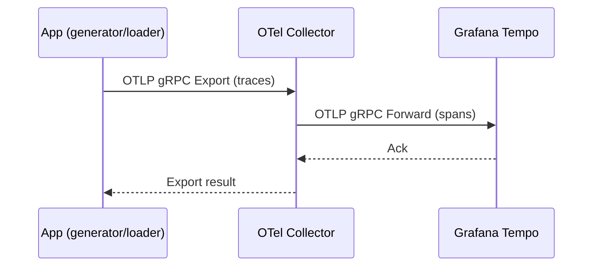

# Architecture Overview

This page demonstrates Mermaid diagrams in our GitBook and shows the end-to-end observability architecture used in this project.

## Observability Stack (high level)

```text
flowchart LR
  subgraph Apps
    G[generator*] -->|OTLP traces| OC[OTel Collector]
    L[loader*] -->|OTLP traces| OC
    G -->|/metrics| PM[Prometheus]
    L -->|/metrics| PM
    G -->|pprof/pyroscope| PY[Pyroscope]
    L -->|pprof/pyroscope| PY
    G -->|logs| FD[Fluentd]
    L -->|logs| FD
    G -->|logs| LS[Logstash]
    L -->|logs| LS
  end

  OC -->|spans| TP[Tempo]
  FD -->|labels+lines| LK[Loki]
  LS -->|events| ES[(Elasticsearch)]

  ES --> KB[Kibana]

  subgraph Grafana
    GF[Grafana]
  end

  GF --- PM
  GF --- TP
  GF --- LK
  GF --- PY
```

Legend:
- generator/loader are the example CLI apps in `cmd/`.
- OTel traces go through the Collector to Tempo.
- Prometheus scrapes metrics endpoints.
- Pyroscope collects continuous profiles.
- Logs can flow via Fluentd to Loki, or via Logstash to Elasticsearch (viewed in Kibana).
- Grafana visualizes data from Prometheus, Tempo, Loki, and Pyroscope.

## Sequence (span emission)



Tip: If you don’t see the diagrams, ensure plugins are installed and the book is served using HonKit.
