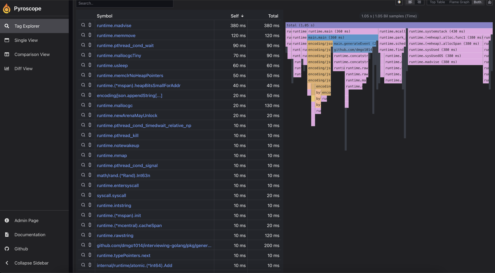
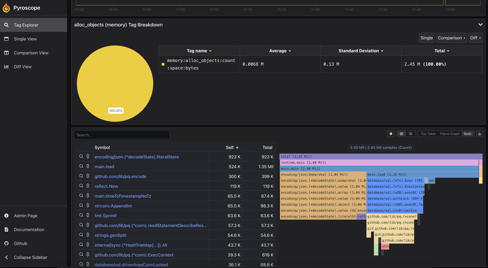

# Grafana Pyroscope Examples

Below are example screenshots from local runs. For a full tutorial, see [Production Profiling Setup](./setup.md).

If the images don’t render in hosted GitBook, copy them into `gitbook/assets/pyroscope/` and update the paths accordingly.
